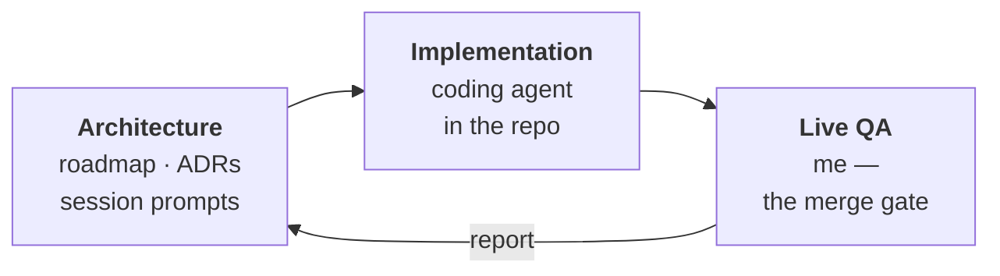

<h1 align="center">Ryan Hopkins</h1>

  <b>Applied AI Engineer</b> · Internal tooling for support &amp; operations teams

  Customer Support → Product at <a href="https://www.nucleos.com/"><b>Nucleos</b></a> <i>(an iT1 company)</i> 
  Justice-tech &amp; correctional education · Multi-agent systems · Fully remote (EST)

  
  
  
  
  
  
  
  

---

## The short version

I build the internal tools that operations teams actually run on — and I build them so an AI can run them too.

My work lives in a specific seam: the messy, undocumented, high-context workflows that exist entirely inside one person's head. I take those apart, rebuild them as multi-agent systems with human approval gates, and leave behind documentation structured well enough that the next teammate — or the next model — can pick it up cold.

Today that's at [Nucleos](https://www.nucleos.com/), where I run customer support for correctional-education deployments and build the platforms that make that work scale past me. I'm targeting **AI Solutions Architect** and **Forward-Deployed Engineer** roles, where this *is* the job.

---

## The niche

**Internal tooling for support and operations.** Support work is the highest-context, lowest-documented function in most companies. It's also where automation pays back fastest, because the same twelve decisions get made forty times a week. I build the systems that make those decisions once, correctly, and repeatably.

**Documentation as machine-readable substrate.** Every workflow I ship becomes a structured artifact — decision records, resolution logs, versioned MDX, knowledge corpora — designed from the start to be retrieved and reasoned over by an LLM. Docs stop being a chore you owe the team and become the data layer your agents run on.

**Human-in-the-loop as architecture, not a setting.** The systems I build hold work at an approval gate and fire only when a person signs off. That's a structural commitment, not a config flag. It's what makes automation deployable in regulated, high-stakes environments where a wrong send has real consequences.

**Context engineering.** Prompts, system cards, and knowledge corpora built so an AI can operate on real support, admin, and dev tasks without being re-briefed every session.

---

## Selected work

### Relay — multi-agent customer support automation
Turns an inbound support request into a reviewed, fired package of artifacts: a ClickUp ticket, an Outlook draft, a Slack handoff, and a ClickUp comment — drafted in my voice, validated, held at a human approval gate, then executed in sequence with the ticket ID propagated into every downstream artifact. Pipeline: `ingest → route → context → parallel drafters → validate → approve → execute → learn`.

LangGraph · FastAPI · PostgreSQL/pgvector · Redis · Next.js 15 · Docker · Slack · ClickUp · Microsoft Graph · Firebase Auth

### Helix — AI documentation generation platform
Crawls a live platform, generates capture flows from a plain-English request, drives Playwright to screenshot each step, then runs a three-agent chain (Structure → Content → QA) that produces versioned MDX. Reviewers edit and approve in a Next.js dashboard; approved docs deploy to a client-scoped Docusaurus site. Built to keep roughly twenty client deployments documented without anyone writing YAML or mapping selectors by hand.

Playwright · Anthropic API · Celery · MinIO · Next.js · Docusaurus · PostgreSQL · prompt caching

### Sentinel — self-healing onboarding monitor
Watches automated onboarding scripts across a large app fleet. When a vendor quietly renames a form field and provisioning silently breaks, Sentinel detects the failure, diffs the DOM against the last known-good baseline, classifies the delta, regenerates the script, validates the fix, and hands an engineer an accept / reject / revert decision with a full change report. Four specialized agents on a LangGraph state machine.

LangGraph · FastAPI · Playwright · PostgreSQL · Next.js · Docker · provider-agnostic LLM client

### AchieveDXP Edge — offline-first learning platform
Education delivery for facilities with little or no internet. A tiered store-and-forward design: locked-down learner devices sync to an on-prem edge node over LAN, and the node reconciles upstream to a central tier opportunistically when connected. Learner data stays on-site by design.

Moodle · Kolibri · Nextcloud/ONLYOFFICE · Kiwix · Docker · Linux · edge sync architecture

### Cognitive Safety Linter — compliance linting for web UIs
Detects dark patterns and deceptive design, maps findings to DSA, FTC, and EDPB frameworks, and produces audit-grade reports with a cryptographic evidence chain. Ships as a CLI, a GitHub Action, and a dashboard. *(Closed source.)*

TypeScript monorepo · Playwright · Next.js · GitHub Actions · policy engine

### Also
**Open source** — three merged pull requests to [PostHog](https://github.com/PostHog/posthog), spanning MCP integration docs, an AJV schema validation guard, and LLM Analytics annotations on the Django backend. **MyOneFlow** — a production onboarding pipeline automating a workflow that had been called un-automatable.

---

## How I build

I run a three-role loop that lets one person ship at team velocity without losing architectural control.

- **Architecture never touches the keyboard.** Design decisions get made and written down before code exists, and they get an ID — ADR numbers, migration numbers, PR SHAs — so any session can be resumed cold.
- **Every prompt is self-contained.** The coding agent starts fresh each session, so each brief carries its own sync check and its own context. No implicit state.
- **QA is a gate, not a step.** Nothing merges until I've run it live against real infrastructure. Production config is never a QA lever.
- **Scalable over convenient.** When there's a shortcut and a right answer, I build the right answer.

### System Immune Memory (SIM)
A framework I designed and now run across every project. Standard monitoring tells you *that* something broke; SIM tells you *why*, in the context of your architecture, and gets faster each time. Resolved incidents are captured as structured "memory cells" — error signature, root cause, fix, affected components, pattern class, confidence decay — in an append-only Resolution Log that's retrievable by both humans and agents. Pattern classes let a fix learned in one system recognize the same failure in another.

---

## Stack

| | |
|---|---|
| **AI & agents** | Anthropic API · LangGraph · multi-agent orchestration · prompt caching · RAG / pgvector · MCP tool calling · Playwright browser agents |
| **Backend** | Python 3.12 · FastAPI · Celery · SQLAlchemy / Alembic · Node.js |
| **Frontend** | Next.js 15 · React · TypeScript · Tailwind · shadcn/ui |
| **Data** | PostgreSQL + pgvector · Redis · MinIO / S3 · pandas |
| **Infra & CI** | Docker · GitHub Actions · WSL2 / Ubuntu · Google Cloud · Trivy · Packer |
| **Integrations** | Slack · ClickUp · Microsoft Graph / Outlook · Firebase Auth · Google Workspace Admin · ChromeOS device management |

---

## The unusual part of my background

I came to engineering sideways. My master's is in Industrial-Organizational Psychology — the study of how people actually behave inside organizations — and I wrote my first line of code in September 2023, through Stanford Online and Columbia Business School.

That turns out to be exactly the right training for this work. Internal tools rarely fail for technical reasons; they fail because nobody mapped how the work really gets done, or because the system asked people to change habits it had no authority to change. I-O Psych taught me to study the workflow before automating it. Everything I build starts there.

The domain follows from the same place. Most of my work ships into correctional facilities, where uptime isn't an SLA metric — it's whether a learner gets access to education that day.

---

## Currently

- Filling organizational gaps with new **Relay** features and improvements at [Nucleos](https://www.nucleos.com/)
- Open to **AI Solutions Architect** and **Forward-Deployed Engineer** roles
- Off the clock: reading into computational neuroscience and brain-computer interfaces, which I suspect is where this all goes next

---

## Connect

- **LinkedIn** — [linkedin.com/in/ryan-hopkins-253344277](https://linkedin.com/in/ryan-hopkins-253344277)
- **Portfolio** — [proco-rphopkins.github.io/Portfolio](https://proco-rphopkins.github.io/Portfolio/)
- **Email** — [ryan.hopkins2@snhu.edu](mailto:ryan.hopkins2@snhu.edu)

If you're building tools that sit between AI and the people who have to use them every day, I'd like to hear about it.

